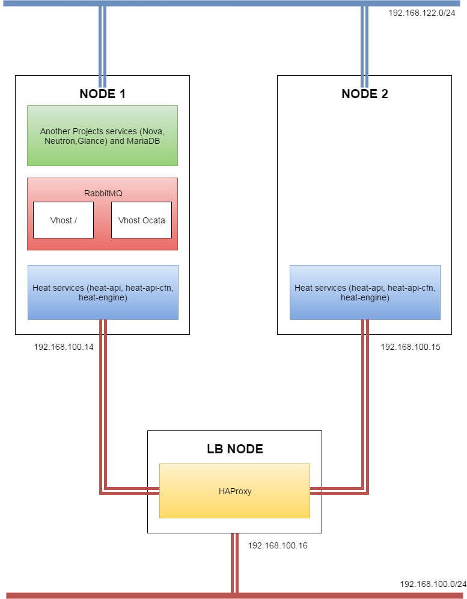

## Heat rolling upgrade in normal environment.



1. Testing environment include 3 VMs (Newton release):
    - Node1: Neutron, Nova, Glance, Heat services.
    - Node2: Heat services only.
    - LBNode: 2 Nodes stay behind LBNode.

2. Clone Heat Ocata source code to 2 Nodes. Put it in folder `heat-ocata`.

3. Create new vhost for Ocata Heat services communication.

    ```
    # rabbitmqctl add_vhost ocata # New vhost named ocata
    # rabbitmqctl set_permissions -p ocata openstack ".*" ".*" ".*"
    ```

4. Backup Database with the bellow command:

    ```
    # mysqldump -u<user> -p<password>  -h<database_ip> heat > heat_newton.sql
    ```

5. Start send several requests to the LB endpoint with the `send_requests.py`
   script. Remember to change configs in `admin-openrc` file. These files in
   `test_heat_status` folder.

6.  Node1: Go to `heat-ocata` folder and install requirements and new version
    of Heat. Repeat this step in Node2.

    ```
    # pip install -r requirements.txt
    # python setup.py install
    ```

7. Change transport\_url config:

    ```
    # In my case, new_vhost = ocata
    transport_url = rabbit://<user>:<password>@<host>:5672/<new_vhost>
    ```

8. Upgrade Database with command:

    ```
    # su -s /bin/sh -c "heat-manage db_sync" heat
    ```

9. Node1: Restart Heat services.

    ```
    # systemctl restart heat-engine
    # systemctl restart heat-api
    # systemctl restart heat-api-cfn
    ```

10. Node2: (Different order) Restart Heat services.

    ```
    # systemctl restart heat-api
    # systemctl restart heat-api-cfn
    # systemctl restart heat-engine
    ```
